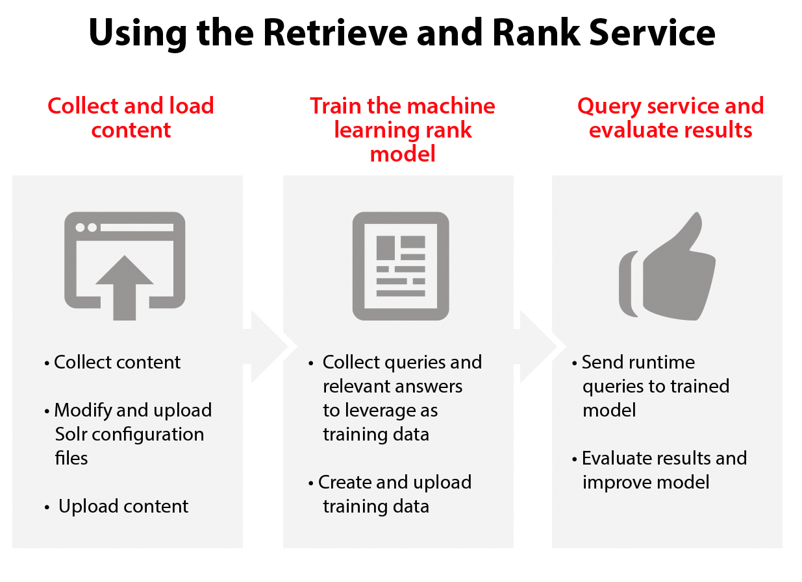

---

copyright:
  years: 2015, 2017
lastupdated: "2017-09-01"

---

{:shortdesc: .shortdesc}
{:new_window: target="_blank"}
{:tip: .tip}
{:pre: .pre}
{:codeblock: .codeblock}
{:screen: .screen}
{:javascript: .ph data-hd-programlang='javascript'}
{:java: .ph data-hd-programlang='java'}
{:python: .ph data-hd-programlang='python'}
{:swift: .ph data-hd-programlang='swift'}

# About
{: #overview}

The {{site.data.keyword.retrieveandrankfull}} service combines two information-retrieval components in a single service: the power of Apache Solr and a sophisticated machine-learning capability. This combination provides users with more relevant results by automatically reranking them based on machine-learning algorithms.
{: shortdesc}

## How to use the service
{: #process}

The following image shows the process of creating and using the {{site.data.keyword.retrieveandrankshort}} service:

For a step-by-step overview of using the {{site.data.keyword.retrieveandrankshort}} service, see the [Getting started tutorial](/docs/services/retrieve-and-rank/getting-started.html).

## Technologies
{: #tech}

The purpose of the {{site.data.keyword.retrieveandrankshort}} service is to help you find documents that are more relevant than those that you might get with standard information-retrieval techniques.

-   **Retrieve**: Retrieve is based on [Apache Solr ](http://lucene.apache.org/solr/){: new_window}. It supports nearly all of the default Solr APIs and improves error handling and resilience. You can start your solution by first using only the retrieve features and then add the ranking component.
-   **Rank**: The rank component (ranker) creates a machine-learning model that is trained on your data. You call the ranker in your runtime queries to use this model to boost the relevance of your results with queries that the model has not previously seen.

The service combines several proprietary machine-learning techniques, which are known as learning-to-rank algorithms. During its training, the ranker chooses the best combination of algorithms from your training data.

## Primary uses
{: #uses}

The core users of the {{site.data.keyword.retrieveandrankshort}} service are customer-facing professionals, such as support staff, contact center agents, field technicians, and other professionals. These users must quickly find relevant results from large numbers of documents.

-   *Customer support:* Find quick answers for customers from your growing set of answer documents.
-   *Field technicians:* Resolve technical issues on-site.
-   *Professional services:* Find the right people with the right skills for key engagements.

## Benefits
{: #benefits}

The {{site.data.keyword.retrieveandrankshort}} service can improve information retrieval as compared to standard results.

-   The ranker models take advantage of rich data in your documents to provide more relevant answers to queries.
-   You benefit from new features developed both by the open source community and from advanced information-retrieval techniques that are built by the {{site.data.keyword.watson}} algorithm teams.
-   Each Solr cluster and ranker is highly available in the {{site.data.keyword.Bluemix_notm}} environment. The scalable {{site.data.keyword.IBM_notm}} infrastructure removes the need for you to staff your own highly available data center.

## About Apache Solr
{: #solr}

As previously mentioned, the retrieve part of the {{site.data.keyword.retrieveandrankshort}} service is based on Apache Solr. To use the service, you need to be knowledgeable about both Solr and the specifics of the service. For example, when Solr passes an error code to the service, the service passes it to your application without modification so that standard Solr clients can correctly parse and respond to it. You therefore need to know about Solr error codes when writing error-handling routines in your {{site.data.keyword.retrieveandrankshort}} application.

To learn about Solr, see [Apache Solr Resources ](http://lucene.apache.org/solr/resources.html){: new_window}. The page provides links to resources including a quick start tutorial, documentation and books, and forums for discussion, advice, and problems.

## About the sample application
{: #sample_app}

A sample application based on the {{site.data.keyword.retrieveandrankshort}} service is available at [Professor Languo ](https://professor-languo.mybluemix.net/){: new_window}. You can also download the application's source files from [GitHub ](https://github.com/watson-developer-cloud/professor-languo){: new_window}. The application enables you to ask questions about standard English usage, with answers processed by a back-end {{site.data.keyword.retrieveandrankshort}} instance from data provided by the Stack Exchange [English Language and Usage ](http://english.stackexchange.com){: new_window} forum.

## About the free Retrieve and Rank instance
{: #free_cluster}

The free cluster that you can create to test the {{site.data.keyword.retrieveandrankshort}} demo application is a single reduced-size unit consisting of a maximum of 50 MB of disk storage. It does not guarantee any specific amount of RAM. The free cluster is meant only to run the demonstration application or small proof-of-concept applications. It cannot be used as a unit in a paid {{site.data.keyword.retrieveandrankshort}} cluster. *The free cluster is not intended for production use.* For more information, see [Sizing your {{site.data.keyword.retrieveandrankshort}} cluster](/docs/services/retrieve-and-rank/using-solr.html#sizingCluster).
