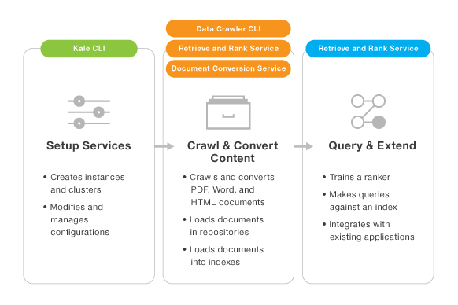

---

copyright:
  years: 2015, 2017
lastupdated: "2017-09-09"

---

{:shortdesc: .shortdesc}
{:new_window: target="_blank"}
{:tip: .tip}
{:pre: .pre}
{:codeblock: .codeblock}
{:screen: .screen}
{:javascript: .ph data-hd-programlang='javascript'}
{:java: .ph data-hd-programlang='java'}
{:python: .ph data-hd-programlang='python'}
{:swift: .ph data-hd-programlang='swift'}

# Building an enhanced information retrieval solution
{: #c_eir_overview}

**Important:** Starting on **11-03-2017**, it will no longer be possible to create a new instance of {{site.data.keyword.retrieveandrankshort}} on Bluemix. Existing service instances will be supported until **10-03-2018**. To continue using features, you will need to (migrate)[/docs/services/discovery/migrate-dcs-rr.html].  **Note:** May not apply in select Dedicated environments.

The {{site.data.keyword.retrieveandrankshort}} service's ability to find the best response to a natural language query from a large set of documents is a natural fit for use in combination with the {{site.data.keyword.documentconversionshort}} service, which focuses on processing formatted documents such as PDFs, Microsoft Word documents, and HTML pages. With the addition of several new developer tools, it is now possible to enable an end-to-end machine-learning enhanced information retrieval solution that can ingest documents from various repositories directly into {{site.data.keyword.retrieveandrankshort}} without writing any code.
{: shortdesc}

Enhanced information retrieval allows you to

-   Scale your information retrieval solution to hundreds of thousands of documents.
-   Focus on getting relevant results rather than document collection and formatting.
-   Manage multiple {{site.data.keyword.watson}} Developer Cloud services from one set of tools without using the {{site.data.keyword.Bluemix_notm}} user interface.

IBM has made it easy to create this end-to-end solution with these tools:

-   **Kale** is a command-line tool that helps you quickly create, configure, and manage the {{site.data.keyword.watson}} services that you need to gather documents and query them. You need your {{site.data.keyword.Bluemix_notm}} ID and password to use Kale.
-   **Data Crawler** is a command-line tool that helps you take your documents from the repositories where they reside and push them to the cloud to automatically create a {{site.data.keyword.retrieveandrankshort}} index.
-   Additionally, there is a [web-based tool](/docs/services/retrieve-and-rank/ranker-tooling.html) designed to help users get started with {{site.data.keyword.retrieveandrankshort}} and {{site.data.keyword.documentconversionshort}} quickly, train a ranker, and easily evaluate improvements between one ranker and another.

    > **Note:** If you created a custom schema for your service, the web-based interface does not work with it currently.

## Prerequisites

You need a {{site.data.keyword.Bluemix_notm}} account. If you do not already have one, see [Getting started with {{site.data.keyword.watson}} and {{site.data.keyword.Bluemix_notm}}](/docs/services/watson/index.html).

## System requirements

### Kale

-   Java Runtime Environment (JRE) version 6 or higher. Version 8 or higher is recommended for optimum security.
-   Kale can be run on any operating system that can run the indicated JRE. For a list of operating systems for which Kale has been validated, see [https://github.com/{{site.data.keyword.IBM_notm}}-{{site.data.keyword.watson}}/kale ](https://github.com/IBM-Watson/kale){: new_window}.

### Data Crawler

-   Java Runtime Environment version 8 or higher. Note that your `JAVA_HOME` environment variable must be set correctly, or not be set at all, to run the Data Crawler.
-   Red Hat Enterprise Linux 6 or 7, or Ubuntu Linux 15 or 16. For optimal performance, IBM strongly recommends that you run the Data Crawler on its own instance of Linux, whether it is a virtual machine, a container, or hardware.
-   Minimum 2 GB RAM on the Linux system.

## What to do next

See [Using Kale](/docs/services/retrieve-and-rank/using-kale.html) to get started by [Downloading and installing Kale](/docs/services/retrieve-and-rank/using-kale.html#c_kale_install).
